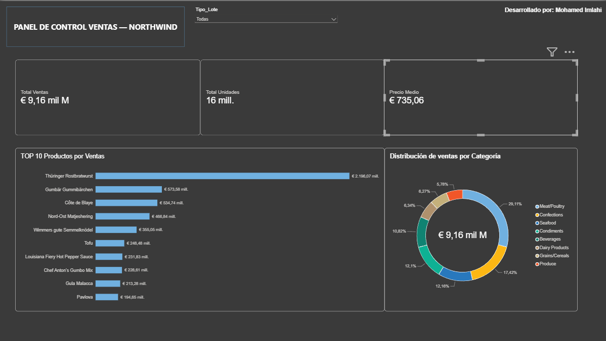

# NorthWind end to end Sales Analyitics & BI Dashboard

[English](#english) | [Español](#español)

---

## English

## Project Overview
This project presents a comprehensive, end-to-end data analysis pipeline for the Northwind e-commerce database. The workflow encompasses raw data exploration in **SQLite**, advanced SQL transformations, data manipulation and statistical correlation analysis in **Python (Pandas)**, and an interactive executive dashboard created in **Power BI**




## Tech Stack & Skills Demonstrated
* **Database & SQL:** SQLite, CTEs (Common Table Expressions), Window Functions (`LAG`, `OVER`), Multi-table JOINs, Subqueries (`EXISTS`, `IN`).
* **Python Analytics:** Pandas, Pearson Correlation Matrices (r), Statistical p-value computation.
* **Business Intelligence:** Power BI, DAX measures, Data Modeling, Dark-mode UX/UI principles.
* **Version Control:** Git & GitHub best practices.

## Repository Structure

```text
.
├── data/
│   ├── raw/             # SQLite database
│   └── processed/       # Extracted CSV datasets & correlation matrices
├── sql/                 # Structured SQL query scripts
├── notebooks/           # Python ETL & statistical analysis notebooks
├── dashboard/           # Power BI .pbix file and visual assets
└── README.md
```
### Key Methodologies
* **Monthly Sales Analysis:** Advanced SQL queries (CTEs and `LAG()`) to calculate sales growth month over month.
* **Correlation Study:** Python analysis to check if discounts effectively drive higher order volumes.
* **Data Cleaning:** Fixing data errors and replacing numeric IDs with actual product and category names.

### Business Insights
* **Top Sales Category:** *Meat/Poultry* generates **29.11%** of total global revenue.
* **Best-Selling Product:** *Thüringer Rostbratwurst* generated the highest sales volume (**€2.19M**).
* **Discount Impact:** Volume discounts successfully encourage larger customer orders without hurting overall profits.


---

## Español

### Descripción del Proyecto
Este proyecto es un análisis de datos completo de punta a punta (**End-to-End**) sobre la base de datos comercial **Northwind**. El flujo abarca desde la exploración de datos originales en **SQLite**, el procesamiento y análisis estadístico en **Python (Pandas)**, hasta la creación de un panel de control ejecutivo interactivo en **Power BI**.


###  Herramientas y Tecnologías
* **Base de Datos & SQL:** SQLite, consultas complejas con CTEs (`WITH`), funciones de ventana (`LAG`, `OVER`), `JOINs` y subconsultas.
* **Análisis de Datos en Python:** Pandas para limpieza de datos, exportación de reportes y matrices de correlación estadística.
* **Business Intelligence:** Power BI para modelado de datos, métricas en DAX y diseño de interfaz ejecutiva en modo oscuro.
* **Control de Versiones:** Git y GitHub aplicando buenas prácticas de estructura y organización.

### Estructura del Repositorio
```text
.
├── data/
│   ├── raw/             # Base de datos SQLite
│   └── processed/       # Conjuntos de datos CSV extraídos y matrices de correlación
├── sql/                 # Scripts de consultas SQL estructuradas
├── notebooks/           # Cuadernos (notebooks) de Python para ETL y análisis estadístico
├── dashboard/           # Archivo .pbix de Power BI y recursos visuales
└── README.md
```

### Metodologías Clave
* **Análisis de Ventas Mensuales:** Uso de SQL avanzado (CTEs y `LAG()`) para calcular cuánto crecen o bajan las ventas de un mes a otro.
* **Estudio de Correlación:** Uso de Python para comprobar si los descuentos realmente ayudan a vender más cantidad de producto.
* **Limpieza de Datos:** Corrección de errores en los datos y cambio de códigos numéricos por los nombres reales de productos y categorías.

### Conclusiones de Negocio
* **Categoría Más Vendida:** La categoría de *Carnes/Aves* (*Meat/Poultry*) genera el **29,11%** de los ingresos totales.
* **Producto Estrella:** El producto *Thüringer Rostbratwurst* es el que más dinero ha generado (**2,19 millones de euros**).
* **Impacto de Descuentos:** Los descuentos por volumen hacen que los clientes hagan pedidos más grandes sin perder margen de beneficio.

### Flujo del Proyecto
1. **Extracción:** Carga de la base de datos `northwind.db` en la carpeta `data/raw/`.
2. **Transformación SQL:** Ejecución de scripts de análisis en la carpeta `sql/` para calcular variaciones de ventas y comportamientos por cliente.
3. **ETL con Python:** Procesamiento en cuadernos Jupyter para generar reportes agrupados en `data/processed/`.
4. **Visualización:** Importación de datos procesados en Power BI para la construcción del Dashboard final.

---


Developer
* **Desarrollado por:** [Mohamed Imlahi]
* **LinkedIn:** [https://www.linkedin.com/in/mohamed-imlahi-0428522b1/]